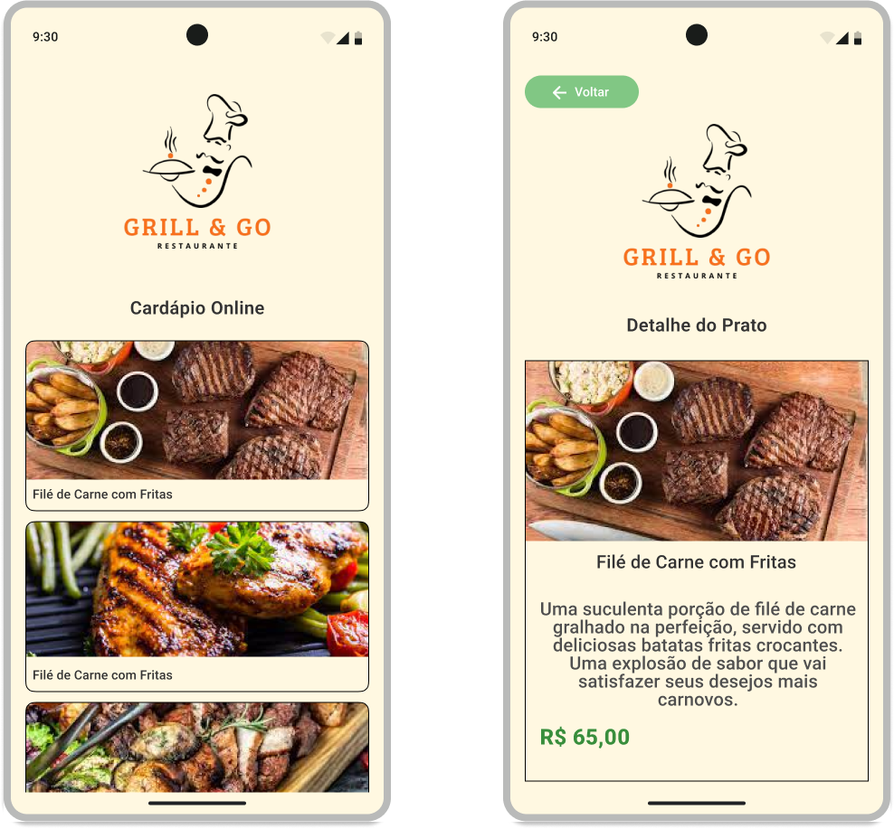

# Virtual Menu - Cardápio Digital para Restaurante

## Sobre o Projeto
Desenvolvi um aplicativo de cardápio virtual para Android usando Kotlin, criando uma experiência intuitiva para visualização de pratos e seus detalhes. O app permite aos usuários navegarem pelos pratos do restaurante de forma simples e elegante.

## Preview

  

## O que ele faz?
O aplicativo oferece:
- Lista completa de pratos do restaurante
- Visualização detalhada de cada item do cardápio
- Navegação intuitiva entre telas
- Informações como imagem, nome, descrição e preço dos pratos

## Como foi feito?
Tecnologias e recursos utilizados:
- Kotlin como linguagem principal
- RecyclerView para lista de pratos
- Material Design para interface moderna
- Navegação entre activities
- Adaptadores para manipulação de dados
- Layout responsivo com LinearLayout e ScrollView
- Testes automatizados com Espresso
- Análise de código com Ktlint e Detekt

## Orientações
#### 1. Clone o repositório
- `git clone https://github.seu-usuario/virtual-menu.git`

#### 2. Configuração
- Abra o projeto no Android Studio
- Sincronize o arquivo `build.gradle`

#### 3. Executar testes
- Rode os testes instrumentados no Android Studio

## Para que serve?
O Virtual Menu simplifica a experiência de consulta de cardápio, permitindo:
- Visualizar pratos disponíveis
- Conhecer detalhes de cada item
- Facilitar a escolha do cliente
- Apresentar informações de forma clara e atraente

---
Desenvolvido por Alex Silva - [@alexcssilva](https://github.com/alexcssilva)